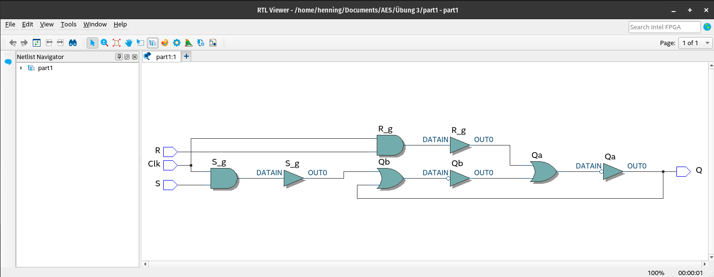
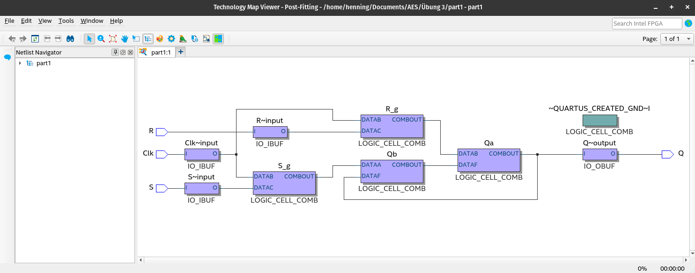
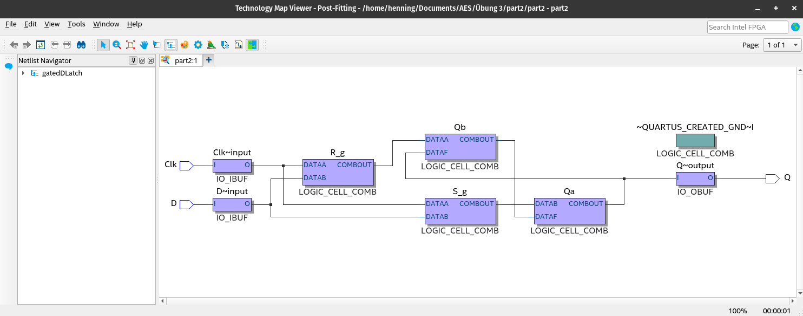
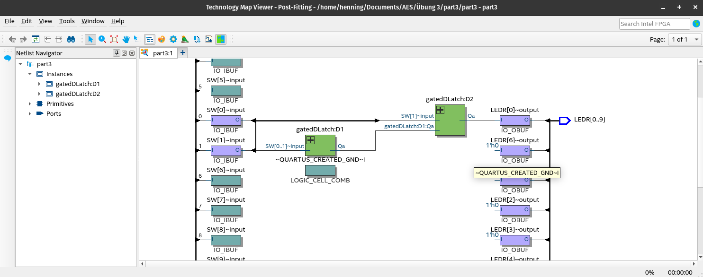

# Architektur Eingebetteter Systeme

## Exercise 1: The first project in Quartus
### Task 1:
In this task, the following instructions were gone through:

[Quartus® Prime Introduction Using VHDL Designs](https://web.archive.org/web/20230430074600/http://mems.ece.dal.ca/eced4260/QuartusPrime.pdf)

GPIO - PIN assignments can be taken from the manual for the board:

[DE10-Standard User Manual](https://web.archive.org/web/20230430073532/https%3A%2F%2Fftp.intel.com%2FPublic%2FPub%2Ffpgaup%2Fpub%2FIntel_Material%2FBoards%2FDE10-Standard%2FDE10_Standard_User_Manual.pdf)

> Device family: Cyclone V (E/GX/GT/SX/SE/ST)
> 
> Name: 5CSXFC6D6F31C6

### Task 2:
The LEDs 0-9 should now be connected directly to the buttons 0-9:
[Exercise_1/Task_2.vhd](Exercise_1/Task_2.vhd)

### Task 3:
Now 2 switches shall control 5 LEDs each:
[Exercise_1/Task_3.vhd](Exercise_1/Task_3.vhd)

## Exercise 2: VHDL Basics
### Task 1:
2-1 Multiplexer: [Exercise_2/A1/multiplexer.vhd](Exercise_2/A1/multiplexer.vhd)

### Task 2:
4-1 Multiplexer: [Exercise_2/A2/multiplexer.vhd](Exercise_2/A2/multiplexer.vhd)

### Task 3:
7 Segment Display: [Exercise_2/A3/multiplexer.vhd](Exercise_2/A3/multiplexer.vhd)

### Task 4:
Carry Ripple Adder: [Exercise_2/A4/rippleadder.vhd](Exercise_2/A4/rippleadder.vhd)

## Exercise 3: Latches, Flip-flops, and Registers
Here we will refer to the [Altera tutorial](https://web.archive.org/web/20230515085651/https://docplayer.net/storage/48/24659104/1684144559/zhY50kay0iTjk9UwB2LhbA/24659104.pdf). Work through
the tutorial Latches, Flip-flops, and Registers. The simulation steps and parts
IV and V of the tutorial are not necessary.
### Task 1:
A gated RS latch circuit: [Exercise_3/A1/part1.vhd](Exercise_3/A1/part1.vhd)

Quartus II RTL Viewer tool:

 Technology Map Viewer tool:

### Task 2:
Circuit for a gated D latch: [Exercise_3/A2/gatedDLatch.vhd](Exercise_3/A2/gatedDLatch.vhd)

Technology Map Viewer tool:

Implementation of the gated D latch: [Exercise_3/A2/part2.vhd](Exercise_3/A2/part2.vhd)

### Task 3:
master-slave D flip-flop: [Exercise_3/A3/part3.vhd](Exercise_3/A3/part3.vhd)

Technology Viewer:

## Exercise 4: Counter in VHDL

### Task 1:
Single Digit Counter on 7 Segment Display
- [Exercise_4/A1/counter.vhd](Exercise_4/A1/counter.vhd)
- [Exercise_4/A1/htb.vhd](Exercise_4/A1/htb.vhd)

### Task 2:
Triple Digit Counter on 7 Segment Display
- [Exercise_4/A2/A2.vhd](Exercise_4/A2/A2.vhd)
- [Exercise_4/A2/htb.vhd](Exercise_4/A2/htb.vhd)

optional with 6x 7 Segment Display: [A3.vhd](Exercise_4/A3/A3.vhd)

## Exercise 5: Hardware CRC-Checker
online CRC Checker that works and is easy to understand: [https://asecuritysite.com/comms/crc_div](https://asecuritysite.com/comms/crc_div)

- [Exercise_5/A1/A1.vhd](Exercise_5/A1/A1.vhd)
- [Exercise_5/A1/CRC.vhd](Exercise_5/A1/CRC.vhd)

## Exercise 6: CRC checker as NIOS II component

Generator/Polynom: 8 bit

- [Exercise_6/A1.vhd](Exercise_6/A1.vhd)
- [Exercise_6/CRC.vhd](Exercise_6/CRC.vhd)

## Exercise 7: NIOS II

[Introduction to the Platform Designer Tool](https://web.archive.org/web/20230622120316/https://ftp.intel.com/Public/Pub/fpgaup/pub/Teaching_Materials/current/Tutorials/Introduction_to_the_Qsys_Tool.pdf)

## Exercise 8: Software-CRC

## Exercise 9: Hardware/Software Co-Design

[Making Qsys Components](https://web.archive.org/web/20230711124620/https://people.ece.cornell.edu/land/courses/ece5760/DE1_SOC/Making_Qsys_Components_15_0.pdf)
